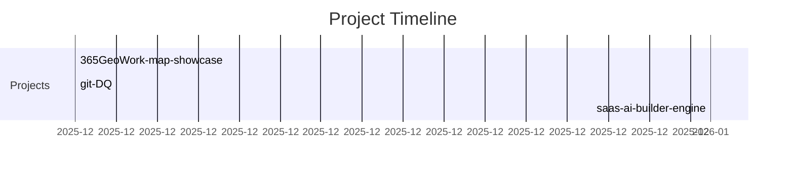

<!--
AUTO-GENERATED. DO NOT EDIT README.md DIRECTLY.
Source of truth:
- data/profile.yml
- data/skills.yml
- data/projects.yml
- evidence/*.md
-->

## 👑 你的名字｜軟體工程師 / 全端工程師 / 後端工程師（自訂）

**把需求變成可維運的產品，把技術變成可交付的價值**

📮 you@example.com

---

## 🚀 我在做什麼（企業快速摘要）

**我在做：把需求落地成可維運產品，並用可驗證證據呈現工程實力**

- 持續交付：把功能做完，也把測試/監控/回滾路徑一起補齊

- 可驗證成果：每個亮點都有 PR/Issue/Release/數據作證

- 工程化沉澱：把一次解法變成可重用的流程/工具/規範

> **自動更新**：本頁由 GitHub Actions 定期重建（你只要寫程式/寫證據/更新專案資料即可）。最後更新：`2026-01-08 14:29 (UTC+8)`

---

## 🧠 你會的技能雷達（Skill Radar）

> 雷達不是自嗨：每個技能都應該能在「實戰證據庫」找到對應的可驗證證據。

---

## 📦 你做過的專案模組（Project Modules）

| Project | One-liner | Tech | Proof |
|---|---|---|---|

| **365GeoWork-map-showcase** `g5120u/365GeoWork-map-showcase` | 地圖任務展示模組（使用 Leaflet + Mock Data） | JavaScript, Leaflet | - |

| **git-DQ** `g5120u/git-DQ` | 讓任何開發資料夾變成 git 化的冒險世界 | JavaScript | - |

| **saas-ai-builder-engine** `g5120u/saas-ai-builder-engine` | Enterprise-grade SaaS UI/UX/System Generator Engine（Powered by Cursor） | TypeScript | - |

---

## 🆕 近期更新專案（自動抓取）

> 目的：你在其他 repo push 後，這裡會在下一次排程刷新時自動反映（不用手動維護）。

| Repo | Last Push | Lang | Stars | Note |
|---|---:|---|---:|---|

| [g5120u](https://github.com/g5120u/g5120u) | `2026-01-08T05:48:14Z` | Python | 0 |  |

| [saas-ai-builder-engine](https://github.com/g5120u/saas-ai-builder-engine) | `2026-01-07T15:15:01Z` | TypeScript | 1 | Enterprise-grade SaaS UI / UX / System Generator Engine Powered by Cursor × Rule-based AI Architecture  This is not a demo website generator. This repository implements a real SaaS Production Engine. |

| [git-DQ](https://github.com/g5120u/git-DQ) | `2025-12-29T05:40:32Z` | JavaScript | 1 | 讓任何開發資料夾git化的冒險世界 |

| [365GeoWork-map-showcase](https://github.com/g5120u/365GeoWork-map-showcase) | `2025-12-23T11:28:25Z` | JavaScript | 1 | 地圖任務展示模組（使用 Leaflet + Mock Data） |

| [MSX](https://github.com/g5120u/MSX) | `2018-09-27T08:48:40Z` | - | 0 |  |

---

## 📈 真實開發證據（Real Dev Proof）

---

## ⏳ 專案進化史（Project Timeline）

---

## 🧾 實戰證據庫（Evidence Vault）

你可以把「做過什麼」升級成「**做過且可驗證**」：

- 索引：[`generated/evidence-index.md`](./generated/evidence-index.md)

- 最新 1 篇：

  - **[案例研究：把一次效能瓶頸變成可重現的性能防線](./evidence/sample-case-study.md)** · `2026-01-01` · performance, backend, observability

---

<b>English version</b>

### 👑 Who I am

**Your Name｜Software Engineer / Full-stack / Backend (customize)**

Turn requirements into maintainable products; turn tech into delivered value

### 🚀 What I'm building

**I build maintainable products and present my impact with verifiable proof**

- Continuous delivery with quality (tests, observability, rollback)

- Verifiable impact (PR/Issue/Release/metrics as proof)

- Engineering leverage (process, tooling, standards)

> **Auto-updated** by GitHub Actions. Last updated: `2026-01-08 14:29 (UTC+8)`

### 🧠 Skill Radar

- ZH: `assets/skill-radar.zh.svg`
- EN: `assets/skill-radar.en.svg`

### 📦 Project Modules

See the table above; each project should have proof links and evidence.

### 📈 Real dev proof

Stats, streak, trophies, and the activity graph above are live signals.

### ⏳ Project timeline

Generated from `data/projects.yml`.

### 🧾 Evidence Vault

Index: `generated/evidence-index.md`

