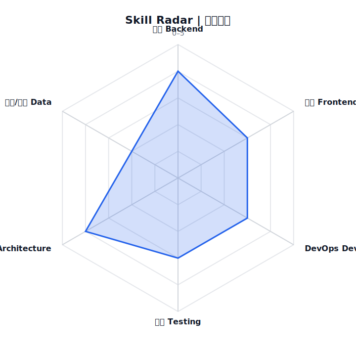

<!--
AUTO-GENERATED. DO NOT EDIT README.md DIRECTLY.
Source of truth:
- data/profile.yml
- data/skills.yml
- data/projects.yml
-->

## 👑 你的名字｜軟體工程師 / 全端工程師 / 後端工程師（自訂）

**把需求變成可維運的產品，把技術變成可交付的價值**

📮 you@example.com

---

## 🚀 我在做什麼（企業快速摘要）

**我在做：把需求落地成可維運產品，並用可驗證證據呈現工程實力**

- 持續交付：把功能做完，也把測試/監控/回滾路徑一起補齊

- 可驗證成果：每個亮點都有 PR/Issue/Release/數據作證

- 工程化沉澱：把一次解法變成可重用的流程/工具/規範

> **自動更新**：本頁由 GitHub Actions 定期重建（你只要寫程式/更新專案資料即可）。最後更新：`2026-01-18 10:38 (UTC+8)`

---

## 🧠 你會的技能雷達（Skill Radar）

> 分數來源：你在 `data/skills.yml` 設定的自評（0–5）。它不會自動讀你的程式碼「推算能力」，但會用你的真實 repo 活動來呈現持續性與產出。

---

## 📦 你做過的專案模組（Project Modules）

| Project | One-liner | Tech | Proof |
|---|---|---|---|

| **365GeoWork-map-showcase** `g5120u/365GeoWork-map-showcase` | 地圖任務展示模組（使用 Leaflet + Mock Data） | JavaScript, Leaflet | - |

| **git-DQ** `g5120u/git-DQ` | 讓任何開發資料夾變成 git 化的冒險世界 | JavaScript | - |

| **saas-ai-builder-engine** `g5120u/saas-ai-builder-engine` | Enterprise-grade SaaS UI/UX/System Generator Engine（Powered by Cursor） | TypeScript | - |

---

## 🆕 近期更新專案（自動抓取）

> 目的：你在其他 repo push 後，這裡會在下一次排程刷新時自動反映（不用手動維護）。

| Repo | Last Push | Lang | Stars | Note |
|---|---:|---|---:|---|

| [g5120u](https://github.com/g5120u/g5120u) | `2026-01-17` | Python | 0 |  |

| [saas-ai-builder-engine](https://github.com/g5120u/saas-ai-builder-engine) | `2026-01-07` | TypeScript | 1 | Enterprise-grade SaaS UI / UX / System Generator Engine Powered by Cursor × Rule-based AI Architecture  This is not a demo website generator. This repository implements a real SaaS Production Engine. |

| [git-DQ](https://github.com/g5120u/git-DQ) | `2025-12-29` | JavaScript | 1 | 讓任何開發資料夾git化的冒險世界 |

| [365GeoWork-map-showcase](https://github.com/g5120u/365GeoWork-map-showcase) | `2025-12-23` | JavaScript | 1 | 地圖任務展示模組（使用 Leaflet + Mock Data） |

| [MSX](https://github.com/g5120u/MSX) | `2018-09-27` | - | 0 |  |

---

## 📈 真實開發證據（Real Dev Proof）

---

## ⏳ 專案進化史（Project Timeline）

| Project | Repo | Range (YYYY-MM) | Status |
|---|---|---|---|

| **365GeoWork-map-showcase** | `g5120u/365GeoWork-map-showcase` | 2025-12 → 2025-12 | active |

| **git-DQ** | `g5120u/git-DQ` | 2025-12 → 2025-12 | active |

| **saas-ai-builder-engine** | `g5120u/saas-ai-builder-engine` | 2026-01 → 2026-01 | active |

---
