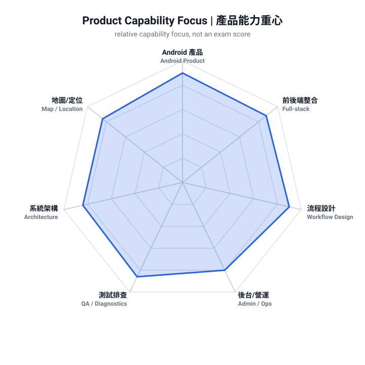

<!--
AUTO-GENERATED. DO NOT EDIT README.md DIRECTLY.
Source of truth:
- data/profile.yml
- data/skills.yml
- data/projects.yml
-->

## g5120u | Software Builder / Android & Full-stack

**把想法整理成可操作的產品流程，持續累積可展示的工程作品**

---

## 🚀 目前方向

**我正在累積 Android 產品、前後端整合與營運流程系統的實作經驗**

- 產品流程：把想法拆成畫面、資料、角色與可操作功能

- 工程實作：用前端、後端、地圖、工具與自動化把作品做出來

- 持續整理：把練習專案、工具實驗與實作紀錄收斂成可閱讀的作品集

> 本頁由資料檔產生，GitHub Actions 只負責定期整理近期公開 repo 動態。

---

## 🔒 私有產品開發（Private Product Work）

**目前有 Android 產品可透過 Google Play 與手機現場展示；公開頁面只呈現產品落地能力，不公開核心原始碼與商業流程。**

- 公開可見：Google Play 上的接就到 Android App，可作為實機展示與產品完成度證明

- 實作範圍：手機端流程、角色/任務流程、後台整合、測試與問題排查

- 保留不公開：原始碼、結算流程、營運細節、資料設計與核心商業邏輯

---

## 🧠 技能雷達（Skill Radar）

> 分數來源：你在 `data/skills.yml` 設定的自評（0–5）。它不會自動讀你的程式碼「推算能力」，但會用你的真實 repo 活動來呈現持續性與產出。

---

## 📦 公開展示作品（Public Samples）

| Project | One-liner | Tech | Proof |
|---|---|---|---|

| **365GeoWork-map-showcase** `g5120u/365GeoWork-map-showcase` | 地圖任務展示模組（公開示範，使用 Leaflet + Mock Data） | JavaScript, Leaflet | - |

## 🧪 實驗室 / 練習作品區（Labs）

| Project | What it explores | Tech |
|---|---|---|

| **git-DQ** `g5120u/git-DQ` | 把 Git 操作包裝成互動式練習體驗 | JavaScript |

| **saas-ai-builder-engine** `g5120u/saas-ai-builder-engine` | SaaS UI/UX 與系統產生器的實驗性架構練習 | TypeScript |

---

## 🆕 近期公開 repo 動態（Public Activity）

> 只整理公開 repo 的活動訊號；私有產品與核心流程不會放在這裡。

| Repo | Last Push | Lang | Note |
|---|---:|---|---|

| [saas-ai-builder-engine](https://github.com/g5120u/saas-ai-builder-engine) | `2026-01-07` | TypeScript | SaaS UI/UX 與系統產生器的實驗性架構練習 |

| [git-DQ](https://github.com/g5120u/git-DQ) | `2025-12-29` | JavaScript | 把 Git 操作包裝成互動式練習體驗 |

| [365GeoWork-map-showcase](https://github.com/g5120u/365GeoWork-map-showcase) | `2025-12-23` | JavaScript | 地圖任務展示模組（公開示範，使用 Leaflet + Mock Data） |

---

## 📈 開發紀錄（Development Proof）

---

## ⏳ 專案進化史（Project Timeline）

| Project | Repo | Range (YYYY-MM) | Status |
|---|---|---|---|

| **365GeoWork-map-showcase** | `g5120u/365GeoWork-map-showcase` | 2025-12 → 2025-12 | active |

| **git-DQ** | `g5120u/git-DQ` | 2025-12 → 2025-12 | active |

| **saas-ai-builder-engine** | `g5120u/saas-ai-builder-engine` | 2026-01 → 2026-01 | active |

---
