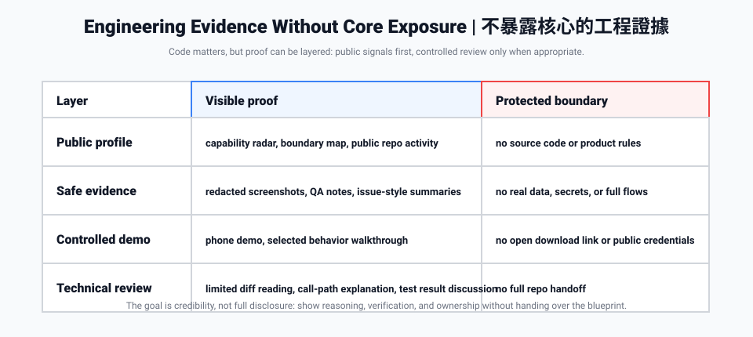
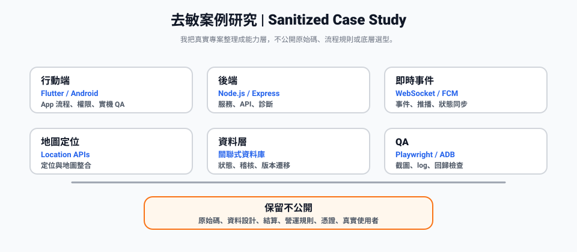

<!--
AUTO-GENERATED. DO NOT EDIT README.md DIRECTLY.
Source of truth:
- data/profile.yml
- data/skills.yml
- data/projects.yml
-->

## g5120u | Software Builder / Android & Full-stack

**把想法整理成可操作的產品流程，持續累積可展示的工程作品**

---

## 🚀 目前方向

**我正在累積 Android 產品、前後端整合與營運流程系統的實作經驗**

- 產品流程：把想法拆成畫面、資料、角色與可操作功能

- 工程實作：用前端、後端、地圖、工具與自動化把作品做出來

- 工具取捨：優先整合成熟工具，必要時才補足流程銜接與驗證用的私有工具

- 持續整理：把練習專案、工具實驗與實作紀錄收斂成可閱讀的作品集

> 本頁由資料檔產生，GitHub Actions 只負責定期整理近期公開 repo 動態。

---

## 🔒 私有產品開發（Private Product Work）

**目前有 Android 產品可透過 Google Play 與手機現場展示；公開頁面只呈現產品落地能力，不公開核心原始碼與商業流程。**

- 公開可見：Google Play 上的接就到 Android App，可作為實機展示與產品完成度證明

- 實作範圍：手機端流程、角色/任務流程、後台整合、測試與問題排查

- 私有工具：包含實務流程輔助、原型驗證與跨領域工具整合，不公開專案名稱與實作細節

- 保留不公開：原始碼、結算流程、營運細節、資料設計與核心商業邏輯

---

## 🧠 我目前能公開說的工程痕跡

| 能力面 | 我做過的類型 | 公開說到這裡為止 |
|---|---|---|
| 行動端 | App 流程、登入/狀態/權限、實機驗證 | 可現場展示，不放商店連結 |
| 後端 | API、服務切分、流程串接、錯誤處理 | 不公開原始碼與內部路由細節 |
| 即時事件 | 狀態同步、推播、事件驗證 | 不公開事件規則與完整流程 |
| 地圖定位 | 地圖呈現、定位、地址/座標流程 | 不公開圖資供應商與底層選型 |
| 資料層 | 關聯式資料庫、資料演進、稽核紀錄 | 不公開 schema 與商業資料 |
| QA / 除錯 | 實機畫面、log、截圖證據、回歸檢查 | 只展示去敏證據與受控走讀 |

---

## 🧱 一年實務專案痕跡（Private Build Evidence）

| 證據面 | 可以公開說的內容 | 不公開的內容 |
|---|---|---|
| 專案規模 | 長期維護的 Android + Web + Backend 工作區 | 真實 repo、原始碼、部署方式 |
| 行動端驗證 | 有實機畫面、登入/登出、權限、狀態恢復、冷啟動等 QA 證據 | 商店連結、測試帳號、真實使用資料 |
| 後端與服務 | 有服務切分、API、錯誤處理、診斷與啟動腳本痕跡 | 內部路由、商業規則、環境變數 |
| 即時流程 | 有即時事件、推播、狀態同步與裝置端驗證痕跡 | 完整事件規則與流程細節 |
| 地圖定位 | 有定位、地址/座標、地圖整合與地理資料處理痕跡 | 圖資供應商、金鑰、底層選型 |
| 資料演進 | 有資料版本遷移、稽核、身份/文件流程與狀態資料痕跡 | schema、結算、營運與敏感資料 |
| QA / 除錯 | 有 Playwright、ADB、log、截圖、流程回歸與問題排查痕跡 | 未去敏截圖、帳號資訊、完整測試資料 |

> 我不把真實專案整包公開；我能用去敏證據說明工程量、問題處理方式與交付過程。

---

## 🧩 AI 協作與驗收方式

| Step | 我負責的事 | 可被追問的證據 |
|---|---|---|
| 需求拆解 | 把需求拆成角色、狀態、畫面與限制 | 能說明我想解決什麼問題 |
| 流程確認 | 對照畫面、操作路徑與狀態結果確認方向 | 能說明使用者從哪一步走到哪一步 |
| 模型協作 | 用 AI 協助整理方案、產生修改、定位可能問題 | 能說明我給了什麼限制與驗收條件 |
| 結果驗收 | 用實機畫面、log、截圖、回歸檢查確認結果 | 能拿出驗收方式與問題排查紀錄 |
| 交付掌控 | 不把沒驗過、看不出行為結果的修改當成完成 | 能現場展示指定流程的結果 |

> 我不把「AI 產生了程式」當成完成；我看重的是需求是否被正確拆解、畫面與流程是否符合預期、問題是否能被重現與驗收。

---

## 🧾 工程證據鏈（Engineering Evidence）

> 對外展示的是可驗證的工程痕跡：需求拆解、去敏畫面、測試紀錄、問題排查與受控走讀；核心原始碼、資料設計與完整商業流程不公開。

---

## 🛠️ 技術棧與實作範圍（Tech Stack Scope）

> 這裡呈現公開可理解的實作範圍，不用百分比包裝能力，也不公開核心程式。

| Layer | Tools | Practical scope |
|---|---|---|

| Mobile | Flutter / Android | App 流程、實機展示、登入/狀態/權限與行動端 QA |

| Backend | Node.js / Express | API、服務切分、流程串接、錯誤處理與診斷 |

| Realtime | WebSocket / FCM | 即時事件、推播、狀態同步與裝置端驗證 |

| Map | Map / Location APIs | 地圖呈現、定位、地址/座標流程與地圖整合 |

| Data | 關聯式資料庫 / 版本遷移 | 資料演進、狀態資料、稽核與流程整理 |

| QA | Playwright / ADB / logs | 瀏覽器流程、手機實機畫面、截圖證據與回歸檢查 |

---

## 🧪 去敏案例研究（Sanitized Case Study）

> 我不公開真實 repo；這裡只把可轉移的工程能力整理成去敏案例：行動端、後端、即時事件、地圖定位、資料演進與 QA 證據。

---

## 📦 公開展示作品（Public Samples）

| Project | One-liner | Tech | Proof |
|---|---|---|---|

| **product-engineering-labs** `profile repo / showcase/product-engineering-labs` | 去敏產品工程樣本：狀態流程、API 邊界、防重複與測試 | Node.js, API, node:test | [Code](https://github.com/g5120u/g5120u/tree/main/showcase/product-engineering-labs) |

| **365GeoWork-map-showcase** `g5120u/365GeoWork-map-showcase` | 地圖任務展示模組（公開示範，使用 Leaflet + Mock Data） | JavaScript, Leaflet | - |

## 🧪 實驗室 / 練習作品區（Labs）

| Project | What it explores | Tech |
|---|---|---|

| **git-DQ** `g5120u/git-DQ` | 把 Git 操作包裝成互動式練習體驗 | JavaScript |

| **saas-ai-builder-engine** `g5120u/saas-ai-builder-engine` | SaaS UI/UX 與系統產生器的實驗性架構練習 | TypeScript |

---

## 🆕 近期公開 repo 動態（Public Activity）

> 只整理公開 repo 的活動訊號；私有產品與核心流程不會放在這裡。

| Repo | Last Push | Lang | Note |
|---|---:|---|---|

| [saas-ai-builder-engine](https://github.com/g5120u/saas-ai-builder-engine) | `2026-01` | TypeScript | SaaS UI/UX 與系統產生器的實驗性架構練習 |

| [365GeoWork-map-showcase](https://github.com/g5120u/365GeoWork-map-showcase) | `2025-12` | JavaScript, Leaflet | 地圖任務展示模組（公開示範，使用 Leaflet + Mock Data） |

| [git-DQ](https://github.com/g5120u/git-DQ) | `2025-12` | JavaScript | 把 Git 操作包裝成互動式練習體驗 |

---

## ⏳ 專案進化史（Project Timeline）

| Project | Repo | Range (YYYY-MM) | Status |
|---|---|---|---|

| **product-engineering-labs** | `profile repo / showcase/product-engineering-labs` | 2026-08 → 2026-08 | active |

| **365GeoWork-map-showcase** | `g5120u/365GeoWork-map-showcase` | 2025-12 → 2025-12 | active |

| **git-DQ** | `g5120u/git-DQ` | 2025-12 → 2025-12 | active |

| **saas-ai-builder-engine** | `g5120u/saas-ai-builder-engine` | 2026-01 → 2026-01 | active |

---
